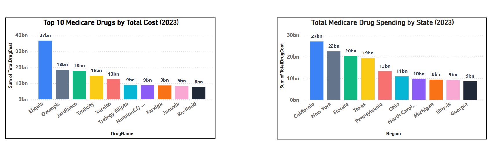

# Pharmacy Sales Analyzer

**Objective:**  
Analyze U.S. Medicare Part D pharmacy sales using Power BI to uncover key insights about drug spending.

---

## Project Overview

This project uses 2023 Medicare Part D drug spending data to answer:

- What are the **top-selling drugs** by total cost?
- Which **regions/states** spend the most on prescriptions?

---

## Folder Structure

Pharmacy-Sales-Analyzer/
├── data/
│ └── medicare_part_d_sales_2023.csv
├── powerbi/
│ └── pharmacy_sales_analyzer.pbix
├── README.md
├── LICENSE

---

## Power BI Visuals

- **Top 10 Drugs by Total Cost**  
- **Total Drug Spending by Region**

Each visual uses clean design, formatted axes, professional labels, and color-coded categories.

---

## Data Source

- [Medicare Part D - Prescribers by Geography and Drug (2023)](https://data.cms.gov/provider-summary-by-type-of-service/medicare-part-d-prescribers/medicare-part-d-prescribers-by-geography-and-drug)

---

## Tools Used

- **Power BI Desktop**
- **Visual Studio Code**
- **Git & GitHub**

---

## License

This project is licensed under the MIT License.
