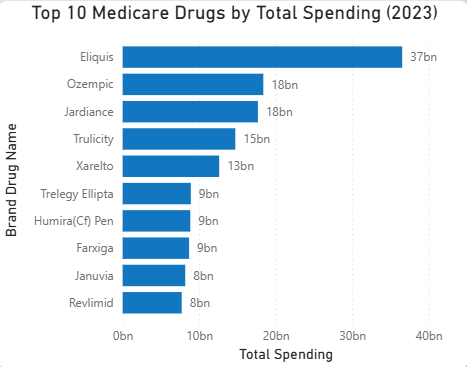
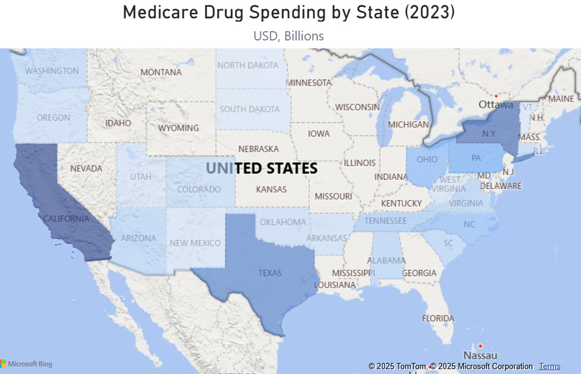

# Pharmacy Sales Analyzer

## Executive Summary / Key Findings
- Total Medicare Part D spending (2023): $[Fill from dashboard]
- Top drug by total cost: [Fill from dashboard]
- Top 3 states by total spending: [Fill from dashboard]
- Average cost per claim: $[Fill from dashboard]
- Total beneficiaries served: [Fill from dashboard]

*Top 10 Medicare Part D drugs ranked by total spending (2023).*

## Geographic Spending
Medicare spending varies greatly by state. This map and chart help identify which regions face the highest drug costs.

*Total Medicare Part D drug spending by state (2023).*

## See the Dashboard

- 📄 [Executive Summary (PDF)](powerbi/pharmacy_sales_analyzer_visuals.pdf) — full two-page dashboard export
- 🖼️ [Top 10 Drugs (PNG)](powerbi/top10_drugs.png)
- 🖼️ [Top 10 States (PNG)](powerbi/top10_states.png)
- 🖼️ [Spending by State Map (PNG)](powerbi/map_state_spend.png)
- 🖼️ [Cost per Beneficiary by State (PNG)](powerbi/top_beneficiary_cost.png)

## Decisions This Enables
- Target education/outreach for the highest-cost drugs.
- Allocate resources to states with disproportionate spending.
- Evaluate brand vs generic substitution opportunities.
- Flag unusually high-cost patterns for fraud or outlier review.

## What's Inside
- `data/medicare_part_d_sales_2023.csv` — CMS Medicare Part D prescriber data (115,936 rows)
- `powerbi/pharmacy_sales_analyzer.pbix` — Power BI Desktop file with data model and visuals

## How to View / Reproduce
1. **Power BI Desktop:** Open `powerbi/pharmacy_sales_analyzer.pbix`
2. Go to **Transform Data** to review cleaning steps
3. **Refresh** data to confirm calculations
4. **Optional:** Use `notebooks/01_baseline_analysis.ipynb` for Python validation (if created)

## Metrics Used
See detailed definitions and DAX formulas in [`powerbi/POWERBI_MEASURES.md`](powerbi/POWERBI_MEASURES.md)

Key metrics:
- Total Spending, Total Claims, Beneficiaries
- Cost per Claim, Cost per Beneficiary
- Top N rankings by geography and drug type

## Data Dictionary & Cleaning
- **Column definitions:** [`DATA_DICTIONARY.md`](DATA_DICTIONARY.md)
- **Cleaning policy:** [`CLEANING.md`](CLEANING.md)
- **QA checks:** Row count validation, null handling for suppressed values

## Limitations & Next Steps
- Medicare Part D only (excludes other insurance types).
- 2023 snapshot only (no trends).
- Suppressed values (`*`, `#`) treated as missing.
- Not adjusted for inflation or population.
- Next Steps: Add multi-year data, normalize by state population, publish live dashboard.