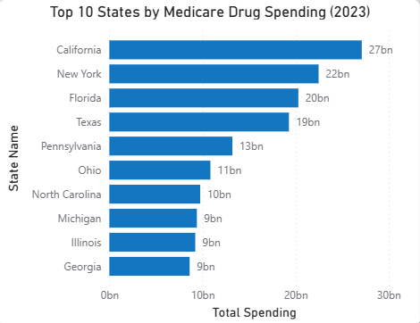
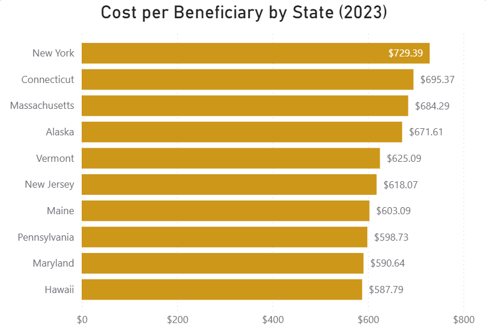

# Pharmacy Sales Analyzer

## 📊 Executive Summary / Key Findings

### 💰 Market Overview
| Metric | 2023 Value |
|--------|------------|
| **Total Medicare Part D Spending** | **$551.11 Billion** |
| **Average Cost per Claim** | $170.42 |
| **Average Cost per Beneficiary** | $566.98 |

### 💊 Top Performance
| Category | Leader | Value |
|----------|--------|-------|
| **Highest Cost Drug** | Eliquis | $37.0 Billion |

### 🗺️ Geographic Distribution
| Rank | State | Total Spending |
|------|-------|---------------|
| 1 | California | $27.0 Billion |
| 2 | New York | $22.0 Billion |
| 3 | Florida | $20.0 Billion |

## See the Dashboard

### Top 10 Drugs by Medicare Spending (2023)
 
*Top 10 Medicare Part D drugs ranked by total spending (2023).*

### Top 10 States by Medicare Drug Spending (2023)
 
*Top 10 states ranked by total Medicare Part D drug spending (2023).*

### Medicare Drug Spending by State Map (2023)
 
*Updated geographic distribution of Medicare Part D drug spending across the United States (2023).*

### Cost per Beneficiary by State (2023)
 
*Average drug costs per Medicare beneficiary by state, highlighting regional cost variations (2023).*

## Decisions This Enables
- Target education/outreach for the highest-cost drugs.
- Allocate resources to states with disproportionate spending.
- Evaluate brand vs generic substitution opportunities.
- Flag unusually high-cost patterns for fraud or outlier review.

## What's Inside
- `data/medicare_part_d_sales_2023.csv` — CMS Medicare Part D prescriber data (115,936 rows)
- `powerbi/pharmacy_sales_analyzer.pbix` — Power BI Desktop file with data model and visuals
- `powerbi/pharmacy_sales_analyzer_visuals.pdf` — Two-page PDF export of the dashboard

## How to View / Reproduce
1. **Power BI Desktop:** Open `powerbi/pharmacy_sales_analyzer.pbix`
2. Go to **Transform Data** to review cleaning steps
3. **Refresh** data to confirm calculations
4. **Optional:** Use `notebooks/01_baseline_analysis.ipynb` for Python validation (if created)

## Metrics Used
See detailed definitions and DAX formulas in [`powerbi/POWERBI_MEASURES.md`](powerbi/POWERBI_MEASURES.md)

Key metrics:
- Total Spending, Total Claims, Beneficiaries
- Cost per Claim, Cost per Beneficiary
- Top N rankings by geography and drug type

## Data Dictionary & Cleaning
- **Column definitions:** [`DATA_DICTIONARY.md`](DATA_DICTIONARY.md)
- **Cleaning policy:** [`CLEANING.md`](CLEANING.md)
- **QA checks:** Row count validation, null handling for suppressed values

## Limitations & Next Steps
- Medicare Part D only (excludes other insurance types).
- 2023 snapshot only (no trends).
- Suppressed values (`*`, `#`) treated as missing.
- Not adjusted for inflation or population.
- Next Steps: Add multi-year data, normalize by state population, publish live dashboard.
